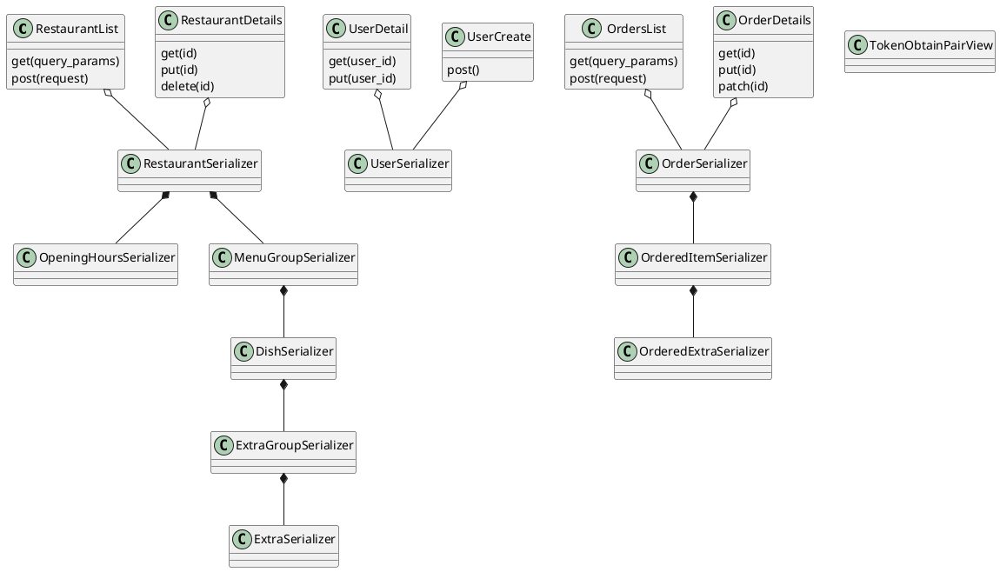

```plantuml
@startuml classes
class RestaurantList
RestaurantList : get(query_params)
RestaurantList : post(request)
class RestaurantDetails
RestaurantDetails : get(id)
RestaurantDetails : put(id)
RestaurantDetails : delete(id)
class UserDetail
UserDetail : get(user_id)
UserDetail : put(user_id)
class OrdersList
OrdersList : get(query_params)
OrdersList : post(request)
class OrderDetails
OrderDetails : get(id)
OrderDetails : put(id)
OrderDetails : patch(id)
class UserCreate
UserCreate : post()
class TokenObtainPairView
class RestaurantSerializer
class OpeningHoursSerializer
class DishSerializer
class MenuGroupSerializer
class ExtraGroupSerializer
class MenuGroupSerializer
class ExtraSerializer
class OrderSerializer
class OrderedItemSerializer
class OrderedExtraSerializer
class UserSerializer
RestaurantSerializer *-- OpeningHoursSerializer
RestaurantSerializer *-- MenuGroupSerializer
MenuGroupSerializer *-- DishSerializer
DishSerializer *-- ExtraGroupSerializer
ExtraGroupSerializer *-- ExtraSerializer
OrderSerializer *-- OrderedItemSerializer
OrderedItemSerializer *-- OrderedExtraSerializer
UserDetail o-- UserSerializer
UserCreate o-- UserSerializer
RestaurantList o-- RestaurantSerializer
RestaurantDetails o-- RestaurantSerializer
OrderDetails o-- OrderSerializer
OrdersList o-- OrderSerializer

@enduml

```