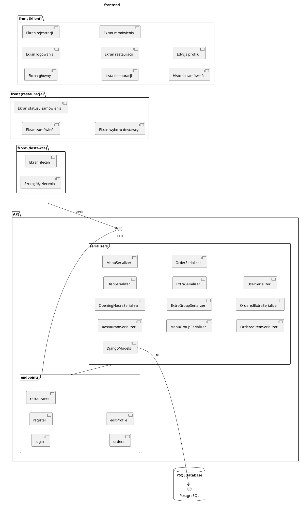

```plantuml
@startuml components
left to right direction

rectangle "frontend" as frontend {
package "front (klient)" as clientFront {
    component "Ekran główny" as homescreen
    component "Ekran logowania" as loginscreen
    component "Ekran rejestracji" as registerscreen
    component "Lista restauracji" as restaurantsscreen
    component "Ekran restauracji" as restaurantscreen
    component "Ekran zamówienia" as orderscreen
    component "Historia zamówień" as orderhistory
    component "Edycja profilu" as profile
}

package "front (restauracja)" as restaurantFront {
    component "Ekran zamówień" as ordersscreen
    component "Ekran statusu zamówienia" as orderstatus
    component "Ekran wyboru dostawcy" as couriers
}


package "front (dostawca)" {
    component "Ekran zleceń" as deliveries
    component "Szczegóły zlecenia" as delivery
}
    }
package "API" {
    interface HTTP
    frame "endpoints" as endpoints {
        component login
        component register
        component restaurants
        component orders
        component editProfile
    }
    frame "serializers" as serializers {
        component DjangoModels
        component RestaurantSerializer
        component OpeningHoursSerializer
        component DishSerializer
        component MenuSerializer
        component MenuGroupSerializer
        component ExtraGroupSerializer
        component MenuGroupSerializer
        component ExtraSerializer
        component OrderSerializer
        component OrderedItemSerializer
        component OrderedExtraSerializer
        component UserSerializer
    }
}

database "PSQLDatabase" {
    interface PostgreSQL
}
frontend --> HTTP : uses
DjangoModels --> PostgreSQL : use
endpoints -d- HTTP
endpoints --> serializers


@enduml
```