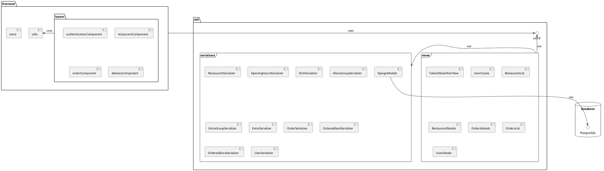

```plantuml
@startuml components

package "frontend" as frontend {
    component store
    component utils
    package "layout" as layout {
        component authenticationComponent
        component restaurantComponent
        component orderComponent
        component deliveryComponent
    }

    layout -> utils : uses

    }
package "API" as API {
    frame "serializers" as serializers {
        component RestaurantSerializer
        component OpeningHoursSerializer
        component DishSerializer
        component MenuGroupSerializer
        component ExtraGroupSerializer
        component MenuGroupSerializer
        component ExtraSerializer
        component OrderSerializer
        component OrderedItemSerializer
        component OrderedExtraSerializer
        component UserSerializer
        component DjangoModels
    }
    together {
    interface HTTP
    frame "views" as endpoints {
        component TokenObtainPairView
        component UserCreate
        component RestaurantList
        component RestaurantDetails
        component OrdersDetails
        component OrdersList
        component UserDetails
    }
}
}

database "Database" {
    interface PostgreSQL
}
frontend -> HTTP : uses
frontend -[hidden]d- [debug]
hide debug
DjangoModels --> PostgreSQL : use
HTTP <-- endpoints : use
HTTP -[hidden]d- [debug3]
hide debug3
endpoints -> serializers : use
endpoints -[hidden]d- [debug2]
hide debug2


@enduml
```