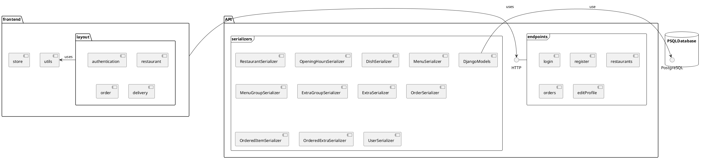

```plantuml
@startuml components

package "frontend" as frontend {
    component store
    component utils
    package "layout" as layout {
        component authentication
        component restaurant
        component order
        component delivery
    }

    layout -> utils : uses

    }
package "API" as API {
    frame "serializers" as serializers {
        component DjangoModels
        component RestaurantSerializer
        component OpeningHoursSerializer
        component DishSerializer
        component MenuSerializer
        component MenuGroupSerializer
        component ExtraGroupSerializer
        component MenuGroupSerializer
        component ExtraSerializer
        component OrderSerializer
        component OrderedItemSerializer
        component OrderedExtraSerializer
        component UserSerializer
    }
    together {
    interface HTTP
    frame "endpoints" as endpoints {
        component login
        component register
        component restaurants
        component orders
        component editProfile
    }
}
}

database "PSQLDatabase" {
    interface PostgreSQL
}
frontend -> HTTP : uses
frontend -[hidden]d- [debug]
hide debug
DjangoModels -> PostgreSQL : use
endpoints - HTTP


@enduml
```