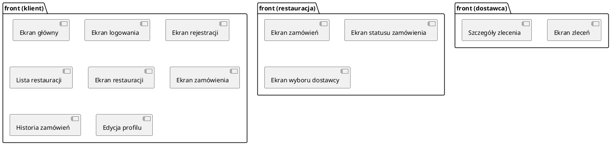

```plantuml
@startuml components
package "front (klient)" {
    component "Ekran główny" as homescreen
    component "Ekran logowania" as login
    component "Ekran rejestracji" as register
    component "Lista restauracji" as restaurants
    component "Ekran restauracji" as restaurant
    component "Ekran zamówienia" as order
    component "Historia zamówień" as orderhistory
    component "Edycja profilu" as profile
}

package "front (restauracja)" {
    component "Ekran zamówień" as orders
    component "Ekran statusu zamówienia" as orderstatus
    component "Ekran wyboru dostawcy" as couriers
}

package "front (dostawca)" {
    component "Ekran zleceń" as deliveries
    component "Szczegóły zlecenia" as delivery
}
@enduml
```