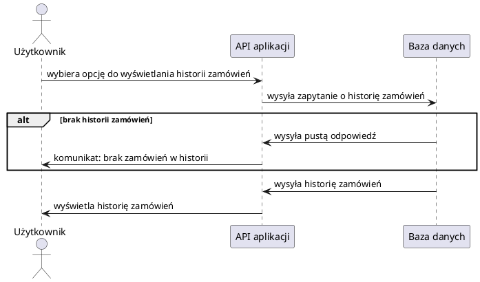

```plantuml
@startuml history
actor Użytkownik as user
participant "API aplikacji" as api
participant "Baza danych" as db


user -> api : wybiera opcję do wyświetlania historii zamówień
api -> db : wysyła zapytanie o historię zamówień
alt brak historii zamówień
    api <- db : wysyła pustą odpowiedź
    user <- api : komunikat: brak zamówień w historii
end
api <- db : wysyła historię zamówień
user <- api : wyświetla historię zamówień
@enduml
```