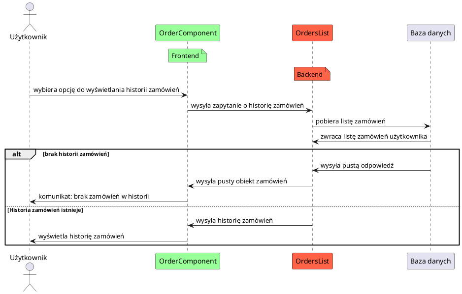

```plantuml
@startuml history
actor Użytkownik as user
participant "OrderComponent" as front #99FF99
participant "OrdersList" as api #FF6347
participant "Baza danych" as db
note over front #99FF99
Frontend
end note
note over api #FF6347
Backend
end note


user -> front : wybiera opcję do wyświetlania historii zamówień
front -> api : wysyła zapytanie o historię zamówień
api -> db : pobiera listę zamówień
db -> api : zwraca listę zamówień użytkownika
alt brak historii zamówień
    db -> api : wysyła pustą odpowiedź
    front <- api : wysyła pusty obiekt zamówień
    user <- front : komunikat: brak zamówień w historii
    else Historia zamówień istnieje
    front <- api : wysyła historię zamówień
    user <- front : wyświetla historię zamówień
end
@enduml
```