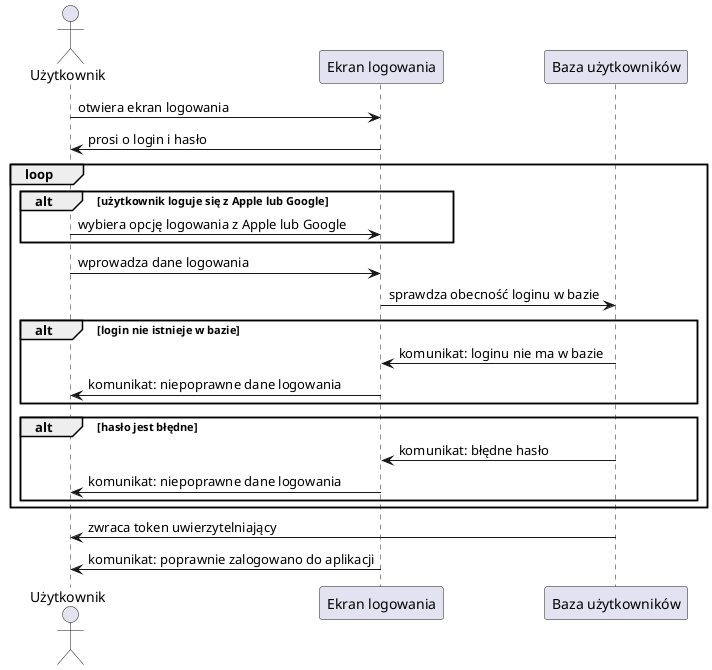

```plantuml
@startuml login
actor Użytkownik as user
participant "Ekran logowania" as log
participant "Baza użytkowników" as db

user -> log : otwiera ekran logowania
user <- log : prosi o login i hasło
loop
    alt użytkownik loguje się z Apple lub Google
        user -> log : wybiera opcję logowania z Apple lub Google
    end
    user -> log : wprowadza dane logowania
 log -> db : sprawdza obecność loginu w bazie
    alt login nie istnieje w bazie
        log <- db : komunikat: loginu nie ma w bazie
        user <- log : komunikat: niepoprawne dane logowania
    end
    alt hasło jest błędne
        log <- db : komunikat: błędne hasło
        user <- log : komunikat: niepoprawne dane logowania
    end
end
user <- db: zwraca token uwierzytelniający
user <- log: komunikat: poprawnie zalogowano do aplikacji
@enduml
```