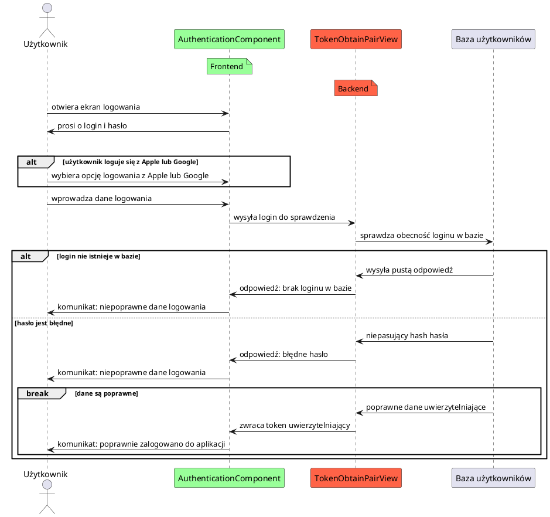

```plantuml
@startuml login
actor Użytkownik as user
participant "AuthenticationComponent" as log #99FF99
participant "TokenObtainPairView" as api #FF6347
participant "Baza użytkowników" as db
note over log #99FF99
Frontend
end note
note over api #FF6347
Backend
end note

user -> log : otwiera ekran logowania
user <- log : prosi o login i hasło
loop
    alt użytkownik loguje się z Apple lub Google
        user -> log : wybiera opcję logowania z Apple lub Google
    end
    user -> log : wprowadza dane logowania
    log -> api : wysyła login do sprawdzenia
    api -> db : sprawdza obecność loginu w bazie
    alt login nie istnieje w bazie
        db -> api : wysyła pustą odpowiedź
        log <- api : odpowiedź: brak loginu w bazie
        user <- log : komunikat: niepoprawne dane logowania
    else hasło jest błędne
        db -> api : niepasujący hash hasła
        log <- api : odpowiedź: błędne hasło
        user <- log : komunikat: niepoprawne dane logowania
    break dane są poprawne
        api <- db: poprawne dane uwierzytelniające
        log <- api: zwraca token uwierzytelniający
        user <- log: komunikat: poprawnie zalogowano do aplikacji
    end 
end
@enduml
```