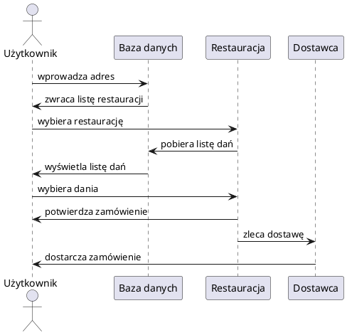

```plantuml
@startuml activity
' "Finalizacja zamówienia" --> (*)
' partition Klient #LightSkyBlue {
'     (*) --> "Składa zamówienie"
'     if "" then
'         --> === S1 ===
'         --> [odrzucone] "Finalizacja zamówienia"
' }
' partition Restauracja #LightGreen {
'     === S1 === --> [ok] "Przyjmuje zamówienie"
'     if "Dostępny dostawca?" then
'         --> [tak] "Przygotowuje zamówienie"
'         --> === S2 ===
'     else
'         --> [nie] "Finalizacja zamówienia"
' }
' partition Dostawca #Pink {
'     === S2 === --> "Odbiera zamówienie"
'     --> "Dowozi zamówienie"
'     --> "Finalizacja zamówienia"
' }
actor Użytkownik as user
participant "Baza danych" as db
participant Restauracja as rest
participant Dostawca as courier
user -> db : wprowadza adres
db -> user : zwraca listę restauracji
user -> rest : wybiera restaurację
rest -> db : pobiera listę dań
db -> user : wyświetla listę dań
user -> rest : wybiera dania
rest -> user : potwierdza zamówienie
rest -> courier : zleca dostawę
courier -> user : dostarcza zamówienie
@enduml
```