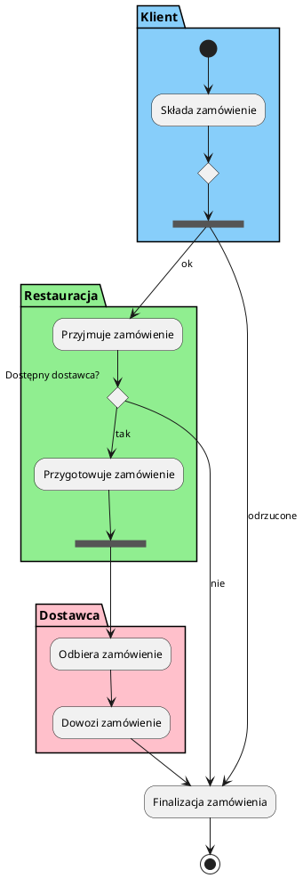

```plantuml
@startuml activity
"Finalizacja zamówienia" --> (*)
partition Klient #LightSkyBlue {
    (*) --> "Składa zamówienie"
    if "" then
        --> === S1 ===
        --> [odrzucone] "Finalizacja zamówienia"
}
partition Restauracja #LightGreen {
    === S1 === --> [ok] "Przyjmuje zamówienie"
    if "Dostępny dostawca?" then
        --> [tak] "Przygotowuje zamówienie"
        --> === S2 ===
    else
        --> [nie] "Finalizacja zamówienia"
}
partition Dostawca #Pink {
    === S2 === --> "Odbiera zamówienie"
    --> "Dowozi zamówienie"
    --> "Finalizacja zamówienia"
}
@enduml
```