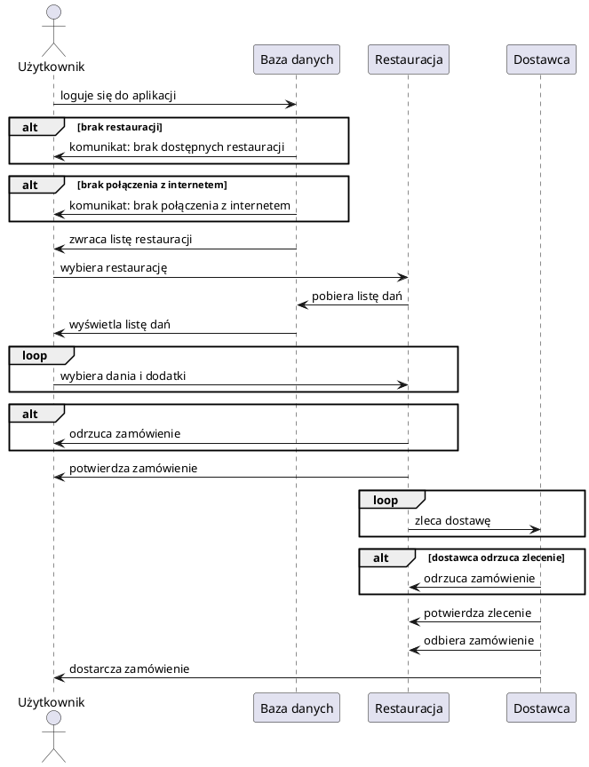

```plantuml
@startuml order
actor Użytkownik as user
participant "Baza danych" as db
participant Restauracja as rest
participant Dostawca as courier
user -> db : loguje się do aplikacji
alt brak restauracji
    user <- db : komunikat: brak dostępnych restauracji
end
alt brak połączenia z internetem
    user <- db : komunikat: brak połączenia z internetem
end

db -> user : zwraca listę restauracji
user -> rest : wybiera restaurację
db <- rest  : pobiera listę dań
user <- db : wyświetla listę dań
loop
    user -> rest : wybiera dania i dodatki
end
alt
user <- rest : odrzuca zamówienie
end
user <- rest : potwierdza zamówienie
loop
    rest -> courier : zleca dostawę
end
alt dostawca odrzuca zlecenie
    rest <- courier : odrzuca zamówienie
end
rest <- courier : potwierdza zlecenie
rest <- courier : odbiera zamówienie
user <- courier : dostarcza zamówienie
@enduml
```