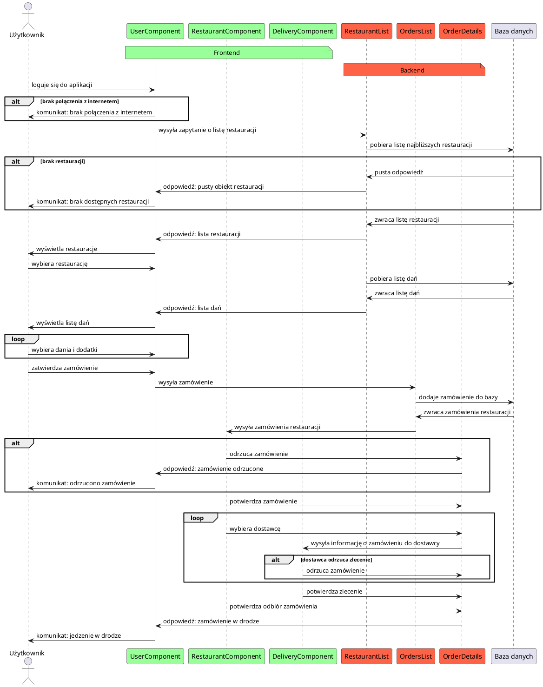

```plantuml
@startuml order
actor Użytkownik as user

participant UserComponent as userview #99FF99
participant RestaurantComponent as rest #99FF99
participant DeliveryComponent as courier #99FF99
participant RestaurantList as restaurantList #FF6347
participant OrdersList as orderlist #FF6347
participant OrderDetails as orderdetails #FF6347
participant "Baza danych" as db
note over userview, courier #99FF99
Frontend
end note
note over restaurantList, orderdetails #FF6347
Backend
end note

user -> userview : loguje się do aplikacji
alt brak połączenia z internetem
    user <- userview : komunikat: brak połączenia z internetem
end
userview -> restaurantList : wysyła zapytanie o listę restauracji
restaurantList -> db : pobiera listę najbliższych restauracji
alt brak restauracji
    restaurantList <- db : pusta odpowiedź
    userview <- restaurantList : odpowiedź: pusty obiekt restauracji
    user <- userview : komunikat: brak dostępnych restauracji
end


db -> restaurantList : zwraca listę restauracji
restaurantList -> userview : odpowiedź: lista restauracji
userview -> user : wyświetla restauracje
user -> userview : wybiera restaurację
db <- restaurantList  : pobiera listę dań
db -> restaurantList : zwraca listę dań
restaurantList -> userview : odpowiedź: lista dań
user <- userview : wyświetla listę dań
loop
    user -> userview : wybiera dania i dodatki
end
user -> userview: zatwierdza zamówienie
userview -> orderlist : wysyła zamówienie
orderlist -> db : dodaje zamówienie do bazy
db -> orderlist : zwraca zamówienia restauracji
orderlist -> rest : wysyła zamówienia restauracji
alt
orderdetails <- rest : odrzuca zamówienie
orderdetails -> userview : odpowiedź: zamówienie odrzucone
userview -> user : komunikat: odrzucono zamówienie
end
orderdetails <- rest : potwierdza zamówienie
loop
    rest -> orderdetails : wybiera dostawcę
    orderdetails -> courier : wysyła informację o zamówieniu do dostawcy
    alt dostawca odrzuca zlecenie
    courier -> orderdetails : odrzuca zamówienie
end
end

courier -> orderdetails : potwierdza zlecenie
rest -> orderdetails : potwierdza odbiór zamówienia
userview <- orderdetails : odpowiedź: zamówienie w drodze
userview -> user : komunikat: jedzenie w drodze
@enduml
```