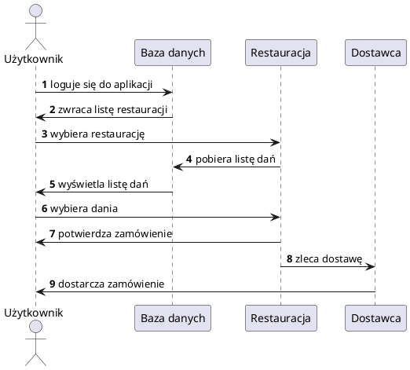

```plantuml
@startuml order
autonumber
actor Użytkownik as user
participant "Baza danych" as db
participant Restauracja as rest
participant Dostawca as courier
user -> db : loguje się do aplikacji
db -> user : zwraca listę restauracji
user -> rest : wybiera restaurację
db <- rest  : pobiera listę dań
user <- db : wyświetla listę dań
user -> rest : wybiera dania
user <- rest : potwierdza zamówienie
rest -> courier : zleca dostawę
user <- courier : dostarcza zamówienie
@enduml
```