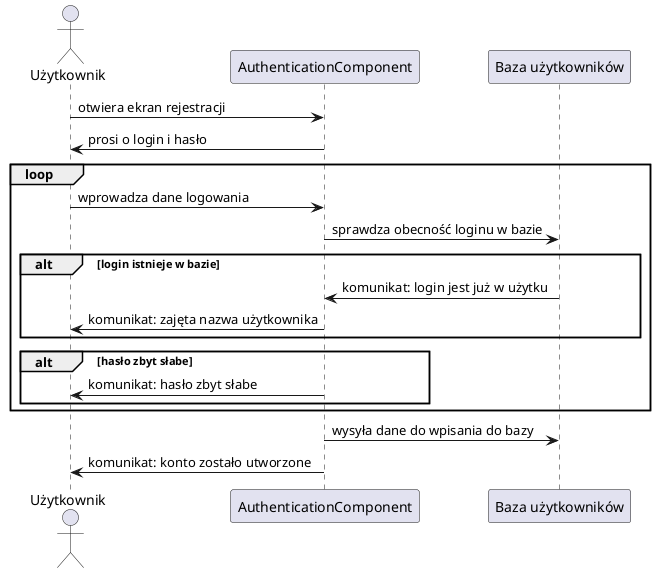

```plantuml
@startuml authister
actor Użytkownik as user
participant "AuthenticationComponent" as auth
participant "Baza użytkowników" as db

user -> auth : otwiera ekran rejestracji
user <- auth : prosi o login i hasło
loop
    user -> auth : wprowadza dane logowania
    auth -> db : sprawdza obecność loginu w bazie
    alt login istnieje w bazie
        auth <- db : komunikat: login jest już w użytku
        user <- auth : komunikat: zajęta nazwa użytkownika
    end
    alt hasło zbyt słabe
        user <- auth : komunikat: hasło zbyt słabe
    end
end
auth -> db : wysyła dane do wpisania do bazy
user <- auth: komunikat: konto zostało utworzone
@enduml
```