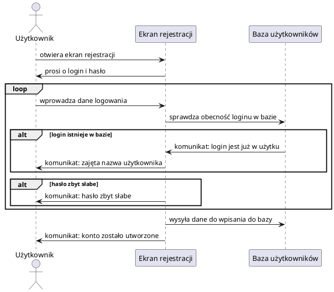

```plantuml
@startuml register
actor Użytkownik as user
participant "Ekran rejestracji" as reg
participant "Baza użytkowników" as db

user -> reg : otwiera ekran rejestracji
user <- reg : prosi o login i hasło
loop
    user -> reg : wprowadza dane logowania
    reg -> db : sprawdza obecność loginu w bazie
    alt login istnieje w bazie
        reg <- db : komunikat: login jest już w użytku
        user <- reg : komunikat: zajęta nazwa użytkownika
    end
    alt hasło zbyt słabe
        user <- reg : komunikat: hasło zbyt słabe
    end
end
reg -> db : wysyła dane do wpisania do bazy
user <- reg: komunikat: konto zostało utworzone
@enduml
```