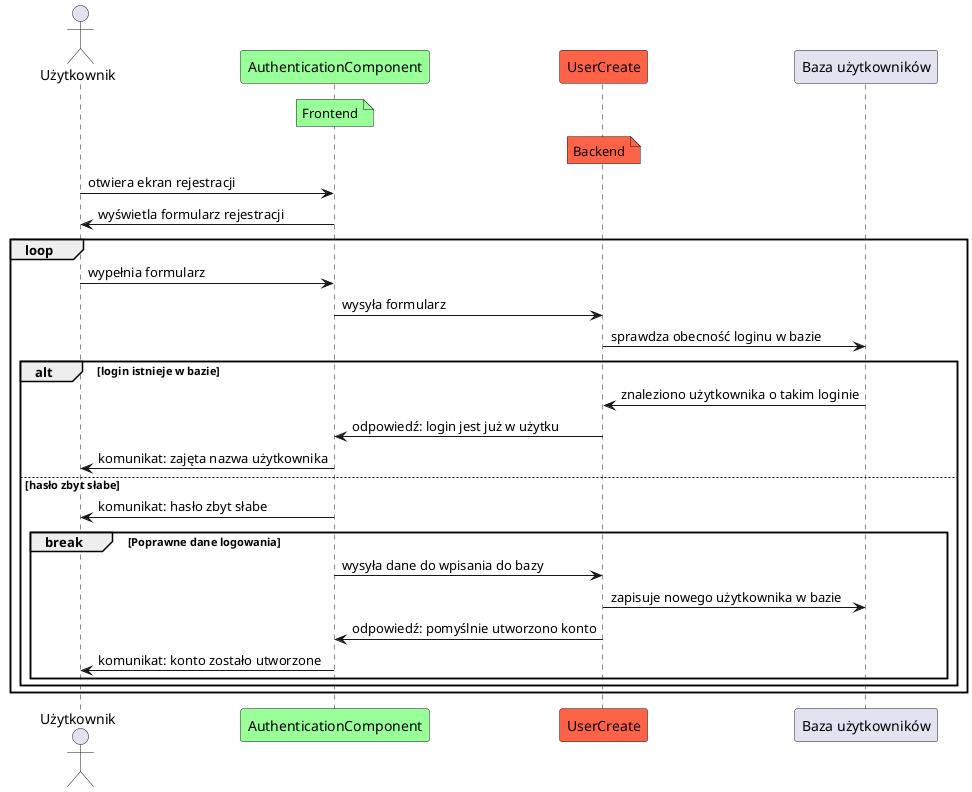

```plantuml
@startuml authister
actor Użytkownik as user
participant "AuthenticationComponent" as auth #99FF99
participant "UserCreate" as register #FF6347
participant "Baza użytkowników" as db
note over auth #99FF99
Frontend
end note
note over register #FF6347
Backend
end note

user -> auth : otwiera ekran rejestracji
user <- auth : wyświetla formularz rejestracji
loop
    user -> auth : wypełnia formularz
    auth -> register : wysyła formularz
    register -> db : sprawdza obecność loginu w bazie
    alt login istnieje w bazie
        register <- db : znaleziono użytkownika o takim loginie
        auth <- register : odpowiedź: login jest już w użytku
        user <- auth : komunikat: zajęta nazwa użytkownika
    else hasło zbyt słabe
         user <- auth : komunikat: hasło zbyt słabe
    break Poprawne dane logowania
        auth -> register : wysyła dane do wpisania do bazy
        register -> db : zapisuje nowego użytkownika w bazie
        auth <- register : odpowiedź: pomyślnie utworzono konto
        user <- auth: komunikat: konto zostało utworzone
    end
    end
end

@enduml
```