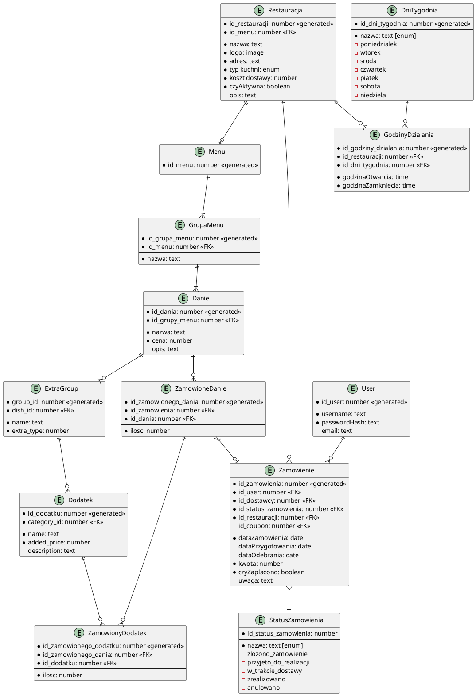

```plantuml

' restauracja: nazwa, 'tagi' kuchni, koszt dostawy, logo, miasto, ulica
' menu restauracji: nazwa dania, typ dania, skład, cena
' typy dania encją? 
' skład encją - produkt 1, produkt 2, produkt 3 itp. produkt musi przechowywac swoja cene?
' produkt: nazwa, cena

@startuml EntityRelationshipGraph
entity Restauracja {
   * id_restauracji: number <<generated>>
   * id_menu: number <<FK>>
   --
   * nazwa: text
   * logo: image
   * adres: text
   * typ kuchni: enum
   * koszt dostawy: number
   * czyAktywna: boolean
   opis: text
}
entity Menu {
   * id_menu: number <<generated>>
}
entity GrupaMenu {
   * id_grupa_menu: number <<generated>>
   * id_menu: number <<FK>>
   --
   * nazwa: text
   ' przechowujemy liczbe okreslajaca w jakiej kolejnosci wyswietlamy rozne grupymenu/potrawy?'
}
entity Danie {
   * id_dania: number <<generated>>
   * id_grupy_menu: number <<FK>>
   --
   * nazwa: text
   * cena: number
   opis: text
   ' * możliweDodatki: json
}
entity ExtraGroup {
   * group_id: number <<generated>>
   * dish_id: number <<FK>>
   --
   * name: text
   * extra_type: number
}
entity Dodatek {
   * id_dodatku: number <<generated>>
   * category_id: number <<FK>>
   --
   * name: text
   * added_price: number
   description: text
}

entity Zamowienie {
   * id_zamowienia: number <<generated>>
   * id_user: number <<FK>>
   * id_dostawcy: number <<FK>>
   * id_status_zamowienia: number <<FK>>
   * id_restauracji: number <<FK>>
   id_coupon: number <<FK>>
   --
   * dataZamowienia: date
   dataPrzygotowania: date
   dataOdebrania: date
   * kwota: number
   * czyZaplacono: boolean
   uwaga: text
}
entity ZamowioneDanie {
   * id_zamowionego_dania: number <<generated>>
   * id_zamowienia: number <<FK>>
   * id_dania: number <<FK>>
   --
   * ilosc: number 
}
entity ZamowionyDodatek {
   * id_zamowionego_dodatku: number <<generated>>
   * id_zamowionego_dania: number <<FK>>
   * id_dodatku: number <<FK>>
   --
   * ilosc: number
}
entity User {
   * id_user: number <<generated>>
   --
   * username: text
   * passwordHash: text
   email: text
}
entity StatusZamowienia {
   * id_status_zamowienia: number
   --
   * nazwa: text [enum]
      -zlozono_zamowienie
      -przyjeto_do_realizacji
      -w_trakcie_dostawy
      -zrealizowano
      -anulowano
}
entity GodzinyDzialania {
   * id_godziny_dzialania: number <<generated>>
   * id_restauracji: number <<FK>>
   * id_dni_tygodnia: number <<FK>>
   --
   * godzinaOtwarcia: time
   * godzinaZamkniecia: time
}
entity DniTygodnia {
   * id_dni_tygodnia: number <<generated>>
   --
   * nazwa: text [enum]
      -poniedzialek
      -wtorek
      -sroda
      -czwartek
      -piatek
      -sobota
      -niedziela
}

Restauracja ||--o{ GodzinyDzialania
DniTygodnia ||--o{ GodzinyDzialania

Restauracja ||--o{ Zamowienie
Restauracja ||--o| Menu
Menu ||--|{ GrupaMenu
GrupaMenu ||--|{ Danie
Danie ||--o{ ExtraGroup
ExtraGroup ||--o{ Dodatek
Danie ||--o{ ZamowioneDanie
ZamowioneDanie ||--o{ ZamowionyDodatek
Dodatek ||--o{ ZamowionyDodatek
User ||--o{ Zamowienie
ZamowioneDanie }|--o| Zamowienie
Zamowienie }|--|| StatusZamowienia

@enduml
```