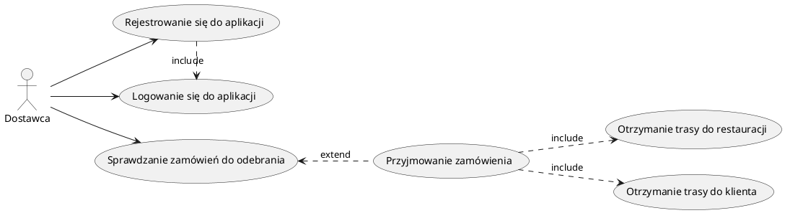

```plantuml
@startuml courierUseCaseDiagram
left to right direction
actor Dostawca as courier

usecase "Sprawdzanie zamówień do odebrania" as uc1
usecase "Otrzymanie trasy do restauracji" as uc2
usecase "Otrzymanie trasy do klienta" as uc3
usecase "Logowanie się do aplikacji" as uc4
usecase "Rejestrowanie się do aplikacji" as uc5
usecase "Przyjmowanie zamówienia" as uc6

courier --> uc1
courier --> uc4
(uc1) <.. (uc6) : extend
(uc6) ..> (uc2) : include
(uc6) ..> (uc3) : include
courier --> uc5
(uc5) .> (uc4) : include

@enduml
```