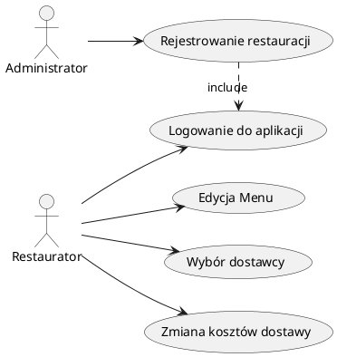

```plantuml
@startuml usecase
left to right direction

actor Restaurator as Res
actor Administrator as Ad

usecase "Logowanie do aplikacji" as uc1
usecase "Edycja Menu" as uc2
usecase "Wybór dostawcy" as uc3
usecase "Rejestrowanie restauracji" as uc4
usecase "Zmiana kosztów dostawy" as uc5

Ad --> uc4
(uc4) .> (uc1) : include
Res --> uc1
Res --> uc2
Res --> uc3
Res --> uc5

@enduml
```