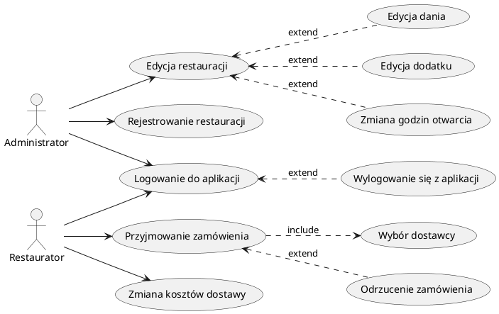

```plantuml
@startuml usecase
left to right direction

actor Restaurator as Res
actor Administrator as Ad

usecase "Logowanie do aplikacji" as uc1
usecase "Edycja restauracji" as uc2
usecase "Wybór dostawcy" as uc3
usecase "Rejestrowanie restauracji" as uc4
usecase "Zmiana kosztów dostawy" as uc5
usecase "Przyjmowanie zamówienia" as uc6
usecase "Odrzucenie zamówienia" as uc7
usecase "Edycja dania" as uc8
usecase "Edycja dodatku" as uc9
usecase "Wylogowanie się z aplikacji" as uc10
usecase "Zmiana godzin otwarcia" as uc11

Ad --> uc4
Ad --> uc2
Ad --> uc1
(uc1) <.. (uc10) : extend 
(uc6) ..> (uc3) : include
(uc6) <.. (uc7) : extend
Res --> uc1
Res --> uc6
Res --> uc5
(uc2) <.. (uc8) : extend
(uc2) <.. (uc9) : extend
(uc2) <.. (uc11) : extend

@enduml
```