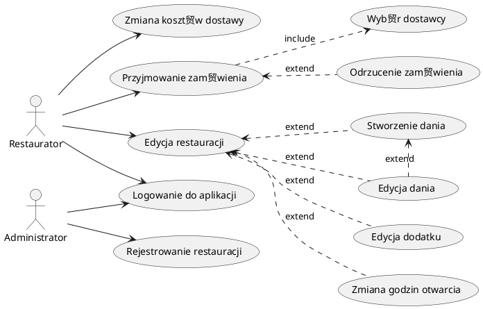

```plantuml
@startuml usecase
left to right direction

actor Restaurator as Res
actor Administrator as Ad

usecase "Logowanie do aplikacji" as uc1
usecase "Edycja restauracji" as uc2
usecase "Wyb贸r dostawcy" as uc3
usecase "Rejestrowanie restauracji" as uc4
usecase "Zmiana koszt贸w dostawy" as uc5
usecase "Przyjmowanie zam贸wienia" as uc6
usecase "Odrzucenie zam贸wienia" as uc7
usecase "Edycja dania" as uc8
usecase "Edycja dodatku" as uc9
usecase "Zmiana godzin otwarcia" as uc11
usecase "Stworzenie dania" as uc12

Ad --> uc4
Ad --> uc1
(uc6) ..> (uc3) : include
(uc6) <.. (uc7) : extend
Res --> uc1
Res --> uc6
Res --> uc5
Res --> uc2
(uc2) <.. (uc8) : extend
(uc2) <.. (uc9) : extend
(uc2) <.. (uc11) : extend
(uc2) <.. (uc12) : extend
(uc12) <. (uc8) : extend

@enduml
```