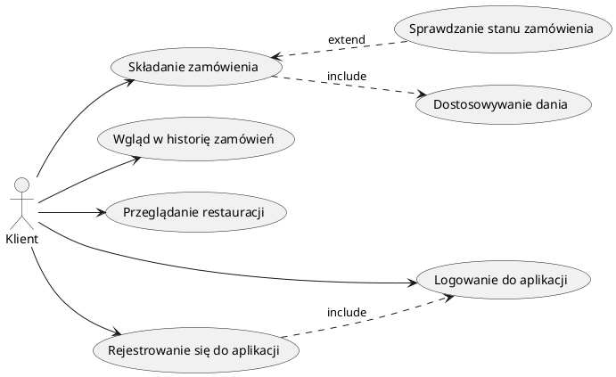

```plantuml
@startuml usecaseDiagram
left to right direction

actor Klient as Kli

usecase "Składanie zamówienia" as uc1
usecase "Wgląd w historię zamówień" as uc2
usecase "Przeglądanie restauracji" as uc3
usecase "Logowanie do aplikacji" as uc4
usecase "Rejestrowanie się do aplikacji" as uc5
usecase "Sprawdzanie stanu zamówienia" as uc6
usecase "Dostosowywanie dania" as uc7

Kli --> uc4
Kli --> uc1
Kli --> uc2
Kli --> uc3
Kli --> uc5
uc3 -[hidden]d-> uc4

(uc5) ..> (uc4) : include
(uc1) <.. (uc6) : extend
(uc1) ..> (uc7) : include

@enduml
```